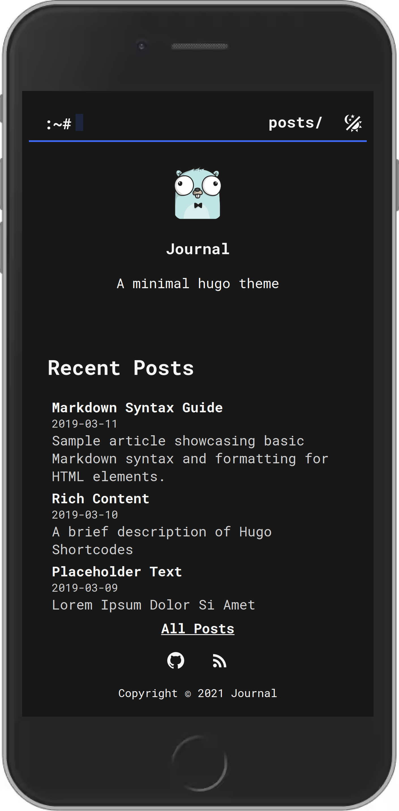

## Journal
A minimal hugo theme for blogs.
<p align="center">
    
<p>
<p align="center">
    <a href="https://hugo-journal.pages.dev">Demo</a>
</p>

### Features
- Responsive and fast
- Minimal JS
- Dark/light modes
- Easy to customize

<p align="center">
    
<p>

### Setup
Import the theme as a submodule  

```bash
git submodule add https://github.com/cvhariharan/hugo-journal themes/journal
cp themes/journal/theme.toml theme.toml
cp themes/journal/config.example.yml config.yml
```

